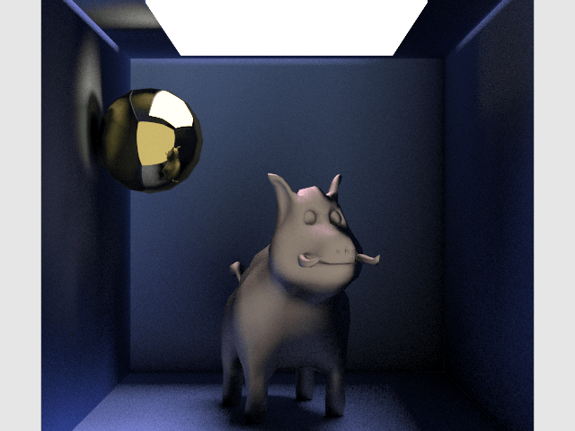
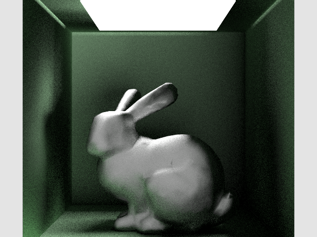

# OpenCL Path Tracer

# Overview

- Supports Metallic and Lambertian [BRDFs](https://en.wikipedia.org/wiki/Bidirectional_reflectance_distribution_function)
- Uses an OpenCL kernel to render samples in parallel
- Simulates millions of light rays along many bounces, accounting for random reflectance, absorbtion, and more.

# Running

1. Build with CMake
1. Run `PathTracer --listDevices` to list the OpenCL devices available.
1. Create a scene configuration file ([instructions here](scene-config-instructions.md)).
1. Run `PathTracer sceneConfigFilename outputImageName` where the output image is a PPM file.

# Testing

1. Build with CMake
2. Run `PathTracer_test`
