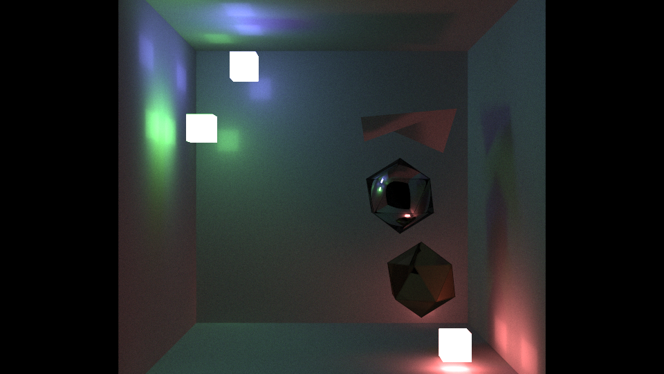
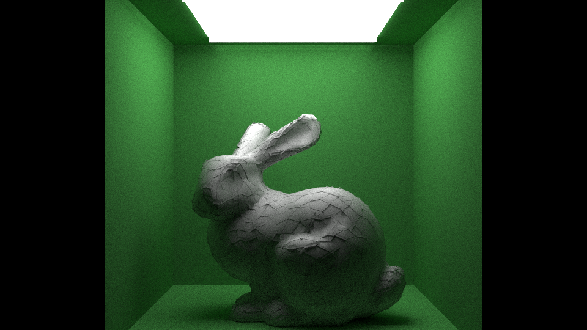

# OpenCL Path Tracer

# Overview
This project is a path tracer using OpenCL for acceleration. A path tracer renders an image by simulating many light paths. Each path behaves according to probability distributions. Every bounce, the light has a chance of being absorbed or reflected. If reflected, the outgoing light ray travels in a direction based on a Bidirectional reflectance distribution function ([BRDF](https://en.wikipedia.org/wiki/Bidirectional_reflectance_distribution_function)). This allows light to be simulated more accurately than other rendering methods and therefore produce more realistic renders. 

# Running

1. Build with CMake
1. Run `PathTracer --listDevices` to list the OpenCL devices available.
1. Create a scene configuration file ([instructions here](scene-config-instructions.md)).
1. Run `PathTracer sceneConfigFilename outputImageName` where the output image is a PPM file.

# Testing

1. Build with CMake
2. Run `PathTracer_tst`
